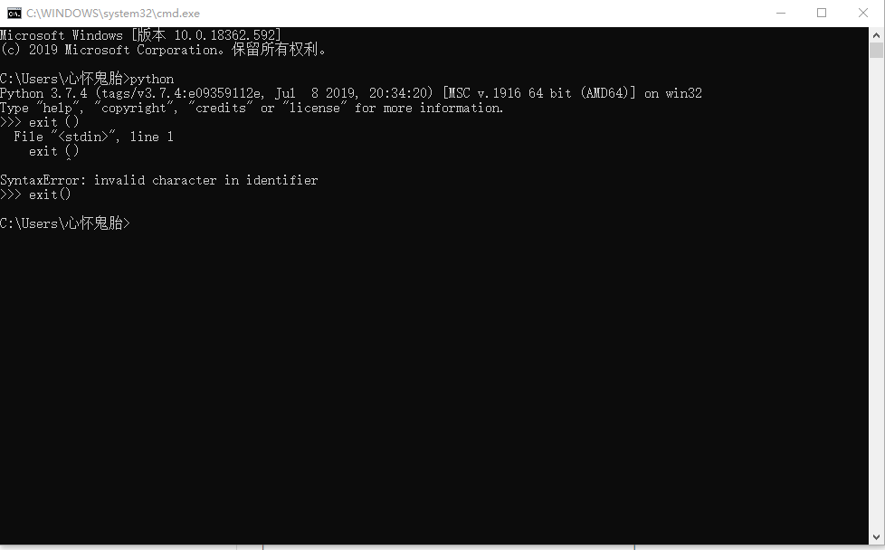
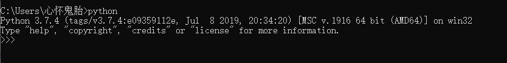
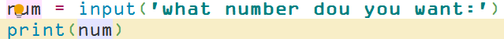
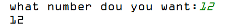
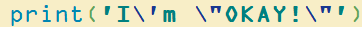
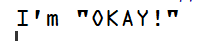
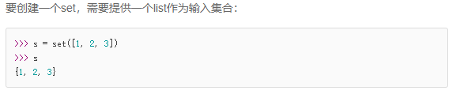

# 基础
## 命令行模式及交互模式
1.python安装完成后设置路径，按下win+R，输入cmd后，弹出的窗口即是命令行模式


2.在命令行中输入python后，就进入Python交互模式。

输入exit()退出交互模式。

## 输入，输出
**print和input函数默认从屏幕和键盘输出和输入**
### 输出
1.使用print(), 在括号中加入字符串，就可以向屏幕上输出指定的文字。

```
print('fuck the world')
```

2.print()函数可以接受多个字符串，用逗号隔开即可，逗号会在编译后输出一个空格。


3. print()函数也可以打印数字.

### 输入
该函数可以使用户输入一个字符串或者数字，然后储存在给定变量中：

    user = input()

**在inpu()函数的括号中可以加入字符串，这样在编译后，程序会先在屏幕上打印出该字符串**

**代码：**


**运行结果：**



## 数据类型和变量
### 整数
Python可以处理任意大小的整数，正负都可以。

1.**正常输入的为十进制**
2.**以0b开头的表示二进制**
3.**以0o开头的表示八进制**
4.**以0x开头的表示十六进制**

### 浮点数
浮点数也就是小数，当数字过大或者过小时，必须使用科学计数法，**将10用e代替，例如1.23e10**

### 字符串
用单引号 ' 或者双引号 " 括起来的任意文本即是字符串！

### 转义字符
当字符串中及包含单引号又包含双引号时，可以用转义字符 \ ：
代码：


结果：


  >**转义字符，顾名思义，将字符语义转换**

1.转义字符可以转义很多字符：
\n 表示换行；    \t表示制表符； \ \表示\；
如果使用r''，则表示默认''内部的字符不进行转义。

2.在交互式命令行中，可以：

### 布尔值
1.**布尔值只有`True`和`False` 两种值（注意是大写），可以直接使用或者通过计算得出**
``` Python
>>> True
True
>>> False
False
>>> 3 > 2
True
>>> 3 > 5
False
```
2.**布尔值的运算符有`and, or, not`分别对应`与，或，非`**
```python
>>> True and False
False

>>> True or False
True

>>> not True
False
```
### 变量
**变量名必须是大小写英文、数字和_的组合，且不能用数字开头**


**在Python中，等号=是赋值语句，可以把任意数据类型赋值给变量，同一个变量可以反复赋值，而且可以是不同类型的变量,这种变量本身类型不固定的语言称之为`动态语言`，与之对应的就是`静态语言`(静态语言必须在定义变量的时候指定变量的类型，如果赋值的时候类型不匹配，会出现报错，例如：Fortran，Java).**

### 常量
**顾名思义，不能变的变量**

### 关于除法
python中的除法有两种：
1.使用 `/` 计算结果是浮点数，即使结果是整数
```python
>>> 10 / 3
3.3333333333333335

>>> 9 / 3
3.0
```
2.**使用`//`，称为地板除法，只取结果的`整数部分`，而相应的使用%是只取结果的`余数部分`。**
```python
>>> 10 // 3
3
>>> 10 % 3
1
```

>**Python的整数没有大小限制**  


## 字符串和编码
### 关于编码的常识


**因为计算机只能处理数字，所以为了处理文本，必须先将文本信息转换成数字才可以。
最早的计算机在设计师采用8bite作为一个byte，所以一个字节表示的最大整数是255(11111111 = 255)，如果想表示更大的数，必须使用更多的字节。**

#### ASCII编码
 最早只有127个字符被编码进计算机，**大小写的英文字母，数字和一些符号**，这个编码表就是所谓的`ASCII表(
(American Standard Code for Information Interchange) `.
但是中文啊，日文啊，韩文啊只用ASCII码是不能处理的，各国有各国自己的标准，会发生冲突，出现乱码。

#### Unicode编码
>最后，Unicode诞生，将所有语言统一到一套编码里。


新的问题又出现了：如果统一成Unicode编码，乱码问题从此消失了。但是，如果你写的文本基本上全部是英文的话，用Unicode编码比ASCII编码需要多一倍的存储空间，在存储和传输上就十分不划算。
所以，本着节约的精神，又出现了把Unicode编码转化为“可变长编码”的UTF-8编码。UTF-8编码把一个Unicode字符根据不同的数字大小编码成1-6个字节，**常用的英文字母被编码成1个字节**，**汉字通常是3个字节**，只有很生僻的字符才会被编码成4-6个字节。如果你要传输的文本包含大量英文字符，用UTF-8编码就能节省空间。

**而编码的工作方式很简单，就是在Unicode和UFT-8之间来回转换，比如，浏览网页的时候，服务器会将动态生成的Unicode内容转换成UFT-8然后再传输到浏览器。**


### 字符串
Python3 中，字符串是以Unicode编码的，所以支持多国语言。

**ord() 函数可以获取字符的整数表示，chr() 则可以将编码转换成对应的字符**：
```python
>>> ord('A')
65
>>> ord('中')
20013
>>> chr(66)
'B'
>>> chr(25991)
'文'
```


len()函数乐意计算str字符串包含了多少字符。


### 字符串格式化
#### 使用 %
`%`运算符就是用来格式化字符串的，其中：

| 占位符 |替换内容  |
| --- | --- |
|%d|整数  |
|%f | 浮点数 |
|%s | 字符串 |
|%x | 十六进制整数 |

```python
>>> 'Hi, %s, you have $%d.' % ('Michael', 1000000)
'Hi, Michael, you have $1000000.'
```

#### 使用format()

另一种格式化字符串的方法是使用字符串的format()方法，它会用传入的参数依次替换字符串内的占位符{0}、{1}……

```python
>>> 'Hello, {0}, 成绩提升了 {1:.1f}%'.format('小明', 17.125)
'Hello, 小明, 成绩提升了 17.1%'
```

## 列表，元组，字典，集合

### 列表(list)
**list 是一个有序的集合，可以随时添加和删除其中的元素**。

1.list使用`[ ]`构建：
```python
>>> classmates = ['张三', '李四', '王二']
>>> classmates
['张三', '李四', '王二']
```


2.使用len()函数即可获得list中元素的个数。
list中的元素按照0,1,2,3,4.........的顺序排列，使用索引来访问列表中的元素：
```python
>>> classmates[0]
'张三'
>>> classmates[1]
'李四'
>>> classmates[2]
'王二'
>>> classmates[3]
Traceback (most recent call last):
  File "<stdin>", line 1, in <module>
IndexError: list index out of range
```
**当索引超出了范围时，Python会报一个IndexError错误，所以，要确保索引不要越界，记得最后一个元素的索引是len(classmates) - 1。**

3.列表是一个可以改变的有序表，使用：
 * classmate.append(元素)  **追加元素到末尾**
 * classmate.insert(索引，元素) **追加元素到指定位置**
 * classmate.pop() **删除末尾元素**
 * classmate.pop(索引) **删除指定位置的元素**

4. 可以将列表中元素进行替换，直接对列表中指定位置的元素直接进行赋值即可。
```python
>>>classmate[1] = '熊大'
>>>classmate
['张三','熊大','王二']
```
5.列表中的元素可以拥有不同的数据类型，甚至，元素本身也可以是列表。


### 元组(tuple)
元组和列表相似，也是有序的，使用`( )` 进行创建。但是，一旦元组初始化后就无法改变，没有添加，删除，置换等操作，只有读取索引。
```python
>>>tuple = (1,2)
>>>tuple
(1,2)
```
### 字典(dict)

**Python内置了字典：dict的支持，dict全称dictionary，在其他语言中也称为map，使用键-值（key-value）存储，具有极快的查找速度。使用`{ }`创建,使用`[ ]`查询**
```python
>>> d = {'Michael': 95, 'Bob': 75, 'Tracy': 85}
>>>d['Michael']
95
```

### 集合(set)


**集合(set)中不能存在重复的元素**


## 条件判断
```
if <条件判断1>:
    <执行1>
elif <条件判断2>:
    <执行2>
elif <条件判断3>:
    <执行3>
else:
    <执行4>
```

``注意，if,elif,else后都带冒号  :``
## 循环

### for ... in ... 循环
**语句：
    for a in b
    将b中的元素遍历，依次赋值给a**

```python
sum = 0
for x in range(101):
    sum = sum + x
print(sum)
```
- **range(i,j)函数：生成一个从i开始小于j的整数序列**
### while 循环

**while循环，只要条件满足，就不断循环，条件不满足时退出循环。**
```Python
sum = 0
n = 99
while n > 0:
    sum = sum + n
    n = n - 2
 print(sum)
```
### break 和 continue
* **break 是结束整个循环**
```python
n = 1
while n <= 100:
    if n > 10: # 当n = 11时，条件满足，执行break语句
        break # break语句会结束当前循环
    print(n)
    n = n + 1
print('END')
```
* **continue 是中断当前循环，开始下一次循环**。
```python
n = 0
while n < 10:
    n = n + 1
    if n % 2 == 0: # 如果n是偶数，执行continue语句
        continue # continue语句会直接继续下一轮循环，后续的print()语句不会执行
    print(n)
```
**上面的语句是将1~10之间奇数打印出来**
